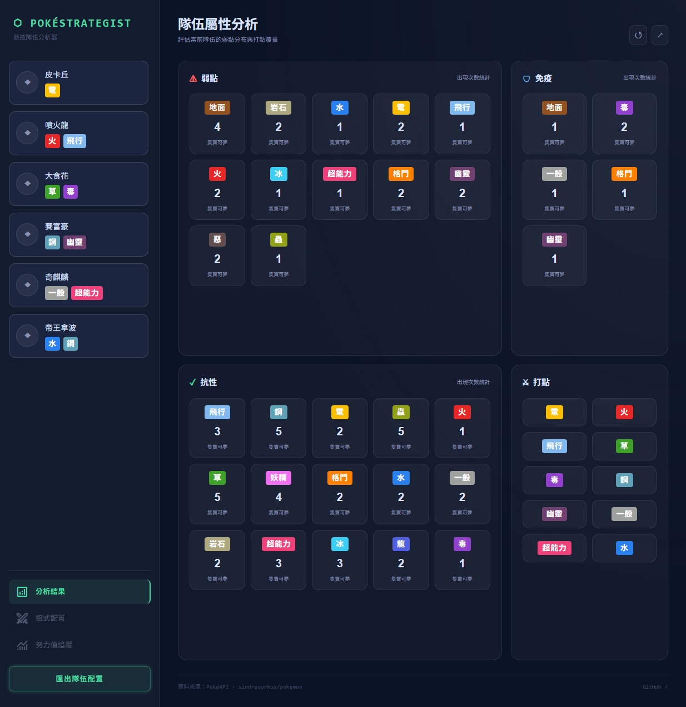
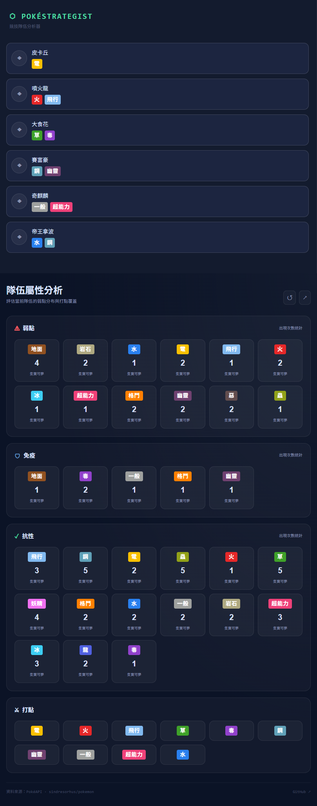

# ⬡ PokéStrategist｜競技隊伍分析器

針對寶可夢競技對戰設計的隊伍屬性分析工具。
輸入隊伍成員後，即時計算整體弱點分布、抗性、免疫與打點覆蓋，協助玩家評估隊伍平衡性。

## 功能

- 支援最多 6 隻寶可夢的隊伍輸入（中文名稱）
- 自動查詢屬性並計算隊伍整體弱點 / 抗性 / 免疫
- 顯示隊伍打點覆蓋的屬性範圍
- 響應式設計，支援桌面與行動裝置

## 技術棧

- React + TypeScript
- Tailwind CSS v4
- Vite

## 串接 API

- [PokéAPI](https://pokeapi.co/) — 查詢寶可夢屬性資料

## 資料來源

- [sindresorhus/pokemon](https://github.com/sindresorhus/pokemon) — 寶可夢中英文名稱對照

## Demo

[連結](https://pokemon-team-type-analyzer.vercel.app/)

## 本地啟動

```bash
git clone https://github.com/parukia35-afk/pokemon-team_type-analyzer
npm install
npm run dev
```

## 專案結構

```
src/
├── components/
│   ├── AnalyzerWrapper.tsx      # 最外層容器，控制整體佈局
│   ├── TypeBadge.tsx            # 屬性 pill 元件
│   ├── InputWrapper/
│   │   ├── InputWrapper.tsx     # 側邊欄，負責隊伍輸入區塊
│   │   └── PokemonInput.tsx     # 單一寶可夢輸入欄位
│   └── OutputWrapper/
│       ├── OutputWrapper.tsx    # 主內容區，負責結果顯示
│       └── ResultSection.tsx    # 單一結果卡片（弱點／抗性／免疫／打點）
├── data/
│   ├── typeChart.json           # 18種屬性相剋對照表
│   ├── typeName.ts              # 屬性英中文對照
│   ├── pokemonName.ts           # 寶可夢中英文名稱對照函式
│   ├── zh-hant.json             # （sindresorhus/pokemon 原始資料）
│   └── en.json                  # （sindresorhus/pokemon 原始資料）
└── utils/
    ├── calcWeakResist.ts        # 計算隊伍弱點／抗性／免疫
    ├── countTypes.ts            # 統計各屬性出現次數
    └── coverageTypes.ts         # 計算隊伍打點覆蓋
```

## 設計思路

要全面評估一支競技隊伍的優劣，實際上涉及的不只是屬性，還包含特性、當前環境的 meta 走向、個人對戰經驗等難以量化的因素。本專案聚焦於屬性分析，作為輔助玩家客觀檢視隊伍配置的工具。

輸入方式上，原本有考慮實作輸入單一字即跳出符合寶可夢的自動補全功能，但考量到競技玩家對寶可夢名稱通常相當熟悉，加上實作自動補全會大幅增加開發複雜度，目前採用輸入全名後按 Enter 進行查詢的方式。

UI 設計稿由 Stitch 輔助生成，程式邏輯規劃與切版皆為自行實作。開發流程上，先完成核心計算邏輯並確認運作正常後，再進行 UI 切版。

## 核心邏輯

透過 PokéAPI 取得寶可夢的英文名稱與屬性資料後，以自行建立的中英文名稱對照表將名稱轉換為中文顯示。

屬性相剋的計算則基於自行建立的 18 × 18 靜態屬性相剋表（`typeChart.json`），而非從 API 取得，並透過自行撰寫的計算邏輯處理後呈現弱點、抗性、免疫與打點覆蓋結果。雙屬性寶可夢的兩種屬性會分別計算，各自納入弱點、抗性或免疫的統計中。

## 已知限制與未來規劃

**已知限制**
- 目前僅支援中文全名輸入
- 名稱對照表依賴外部資料集（sindresorhus/pokemon），新世代寶可夢需等待該資料集更新後手動同步。

**未來規劃**
- 加入單字搜尋自動補全功能
- 加入英文名稱輸入支援
- 招式配置分析
- 努力值追蹤
- 匯出隊伍配置功能

## 畫面截圖

桌面版截圖：

手機版截圖：
